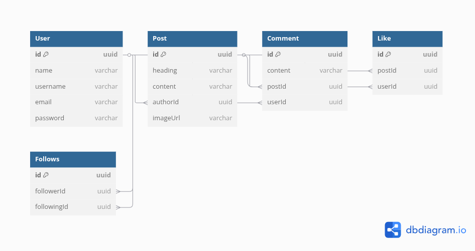

Backend Dev

Routes: 

USER

GET : / users/:username

POST : /auth/signup

POST : /auth/signin

POSTS

GET : /posts/getPosts

POST : /posts/createPost

DELETE : /posts/:postId

COMMENTS

POST : /posts/:postId/comment

LIKES

POST : /posts/:postId/like

DATABASE :

